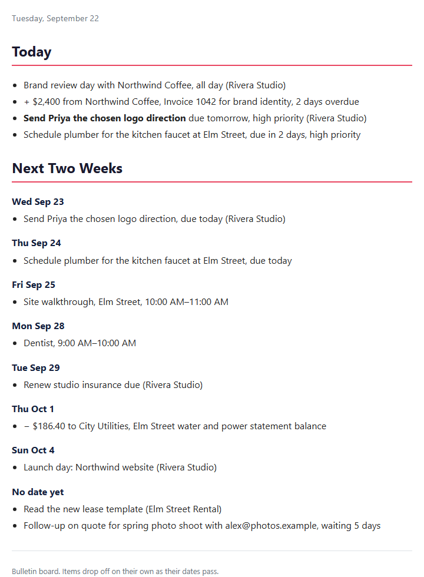
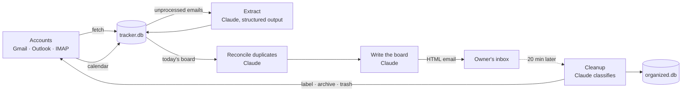

# Email Manager

[](https://github.com/danieljokonek-sys/email-manager-work-sample/actions/workflows/ci.yml)

[](https://github.com/astral-sh/ruff)
[](LICENSE)

> **📌 Work sample.** This is a real tool, shared publicly as a code sample for recruiters and hiring managers. The author runs a private copy of it every morning across five inboxes for several small businesses. This public branch is that tool with secrets and personal data removed, plus the packaging, test suite, and refactors described in the [changelog](CHANGELOG.md). Built solo with Claude Code.

Every morning, one email: the handful of things to know today, then the next two weeks day by day. Deadlines, money owed and owing, action items, and calendar commitments, pulled out of every inbox by Claude. Then the inbox itself gets sorted, labeled, and cleared of junk under rules that cannot delete anything important.

<p align="center">
  <a href="docs/sample-digest.html"></a>
  <br><sub>A board rendered from the bundled sample data (<code>email-manager demo</code>). <a href="docs/sample-digest.html">HTML version</a>.</sub>
</p>

## What it does

1. **Daily briefing.** Reads every account, extracts what matters into a SQLite ledger, and emails a read-only bulletin board. Nothing to check off: items age off by rule as their dates pass.
2. **Inbox cleanup.** Classifies mail into categories you define, then labels, archives, or trashes it. Five guards stand between a classification and the trash.

| Provider | Email | Calendar | Labels |
|----------|-------|----------|--------|
| Gmail | Yes | Yes | Yes (color-coded) |
| Outlook / Hotmail / Microsoft 365 | Yes | Yes | No |
| Yahoo, AOL, iCloud, any IMAP | Yes | No | No |

## Quickstart

```bash
git clone https://github.com/danieljokonek-sys/email-manager-work-sample.git
cd email-manager-work-sample
python -m venv .venv && source .venv/bin/activate    # .venv\Scripts\activate on Windows
pip install -e ".[dev]"
export ANTHROPIC_API_KEY=sk-ant-...
email-manager demo        # builds a board from sample data; one Claude call, no mailbox needed
```

To run it on your own mail, `run.bat` (Windows) or `bash run.sh` (Mac/Linux) opens a setup wizard that writes `config.yaml` and `.env`, connects your accounts, and schedules the daily run. `email-manager run` does everything by hand; `email-manager --help` lists the rest.

## How it works



One `run` is: authenticate each account in isolation, fetch mail and calendar, extract items, apply entity labels, scan sent folders for unanswered threads, build and send the board, wait, clean the inbox. Analysis runs before cleanup so the briefing sees every email before cleanup can archive it. Cleanup skips the briefing itself.

## Design decisions

**A bulletin board, not a to-do app.** The first version had a Flask dashboard with checkboxes. Keeping it running cost more than the check-off saved, so it was removed and the digest was redesigned so items expire by rule: dated items show from three days after their date passes through fourteen days ahead; undated items drop a week after they were first seen; unanswered threads show only while the sent-folder scan keeps finding them. The rules live in one place, `src/email_manager/db/bulletin.py`, with a table-driven test for each.

**One model, effort set per call.** Every call runs on `claude-sonnet-5`. Extraction, duplicate reconciliation, and classification run at low effort; writing the board runs at medium. The model and effort for each stage are config values.

**Structured outputs, never string parsing.** Each extraction and classification call passes a pydantic schema as the API's output format, so the response is constrained server-side and validated client-side. The classification schema is built at runtime with the configured categories as an enum, so the model cannot invent one. A response that is cut off or fails validation raises; a failed batch is left unprocessed and retried next run instead of being silently marked done.

**One provider interface, one message shape.** `EmailClient` is an abstract base; Gmail, Outlook, and IMAP implement it, and a factory builds the right one per account. Messages cross the boundary as one typed dict whichever provider produced them. Date filters cross it as a provider-neutral object that each provider translates into its own query syntax, so no Gmail search operators leak into the pipeline.

**Idempotent by construction.** Three ledgers make re-runs safe: emails are inserted with `INSERT OR IGNORE`, each email is analyzed once and its items are deduplicated on re-analysis, and a separate ledger records every cleanup decision so an email is never re-fetched or re-billed. Schema changes are numbered migrations recorded in SQLite's `user_version`; a failed migration raises instead of being swallowed.

**Cost is visible.** Every Claude call logs one line with its stage, token counts, cache hits, and estimated cost, and `email-manager usage` sums them per day. The board writer receives only the rows that will appear on today's board, trimmed to the fields it needs. The system prompt of each call is marked as a cache breakpoint so batches in one run share it.

**Unattended means no silent failures.** Each account authenticates separately, so one dead OAuth token does not stop the others. A failure is emailed through any account that still works, written to a marker file, and shown as a desktop toast. The scheduler wrapper records the date of the last success and refuses to run twice in one day, so a second trigger cannot send a second briefing.

**Config is typed.** `config.yaml` is validated at start-up into a pydantic model with every default declared, so a typo fails immediately with the field named rather than three stages into a scheduled run. The setup wizard writes the same keys through `yaml.safe_dump`, never string concatenation.

## Safety model

Cleanup can trash mail, so the rules are explicit and tested, in this order:

1. Nothing is ever deleted permanently. `trash_email` moves to the provider's trash.
2. Age-based trashing only happens when you pass `--delete-older-than-days` to `cleanup history`.
3. Categories marked `vital` in your config (tax, legal, banking, security, health, employment by default) are never trashed by age.
4. A low-confidence classification is never trashed. Junk becomes archive.
5. An email with an attachment is never trashed. It is archived instead.

Every cleanup command has `--dry-run`, which prints the decision for each email and changes nothing. Secrets stay out of the repository: tokens, `config.yaml`, `.env`, databases, and logs are git-ignored, and the wizard writes `.env` with owner-only permissions where the OS supports it.

## Cost

Claude Sonnet 5 at low effort. A typical morning for five inboxes is a few extraction batches, one reconcile call, one board call, and one or two classification batches. Run `email-manager usage` for your own numbers. The demo above cost $0.017 for its two calls; the log lines it wrote are in [docs/sample-usage.log](docs/sample-usage.log).

## Project layout

```
main.py                 python main.py <cmd> == email-manager <cmd> (keeps the double-click launchers working)
setup_wizard.py         tkinter setup wizard; writes config through config_writer
src/email_manager/
  cli/                  click commands, one module per group
  pipeline.py           the stages as plain functions that return results
  llm.py                ClaudeClient: structured outputs, effort, caching, retries, usage accounting
  schemas.py            pydantic contracts for everything Claude returns
  prompts/*.md          prompt templates as text, versioned with the code
  config.py             typed config.yaml
  email_client.py       provider contract: EmailClient, EmailMessage, EmailFilter
  providers/            gmail.py, outlook.py, imap_client.py
  briefing/             analyzer (extraction + board writer), reconcile, digest
  cleanup/organizer.py  taxonomy, classification, the guards
  db/                   SQLite: core (connection, migrations), one module per domain, bulletin rules
  notify.py, horizon.py, demo.py, paths.py, logging_setup.py
tests/                  pytest; fakes for the Anthropic SDK and for a mailbox, so nothing needs a network
docs/                   sample digest, Google OAuth setup guide
```

See [ARCHITECTURE.md](ARCHITECTURE.md) for the module map, data flow, and the reasoning behind each boundary. [CLAUDE.md](CLAUDE.md) is the instruction file the project is developed against with Claude Code.

## Development

```bash
pip install -e ".[dev]"
ruff check . && ruff format --check .
mypy
pytest --cov=email_manager
pre-commit install        # optional: ruff on every commit
```

CI runs the same four steps on Ubuntu and Windows for Python 3.11, 3.12, and 3.13. The test suite runs without network access or credentials: a fake Anthropic client returns schema instances, and a fake mailbox records every mutation.

## Known limitations

- IMAP has no folder walk, so `cleanup history --all-mail` is inbox-only on IMAP accounts.
- Outlook and IMAP have no label support; entity labels are Gmail-only, by design.
- The setup wizard is one tkinter file. Its config and scheduler output is tested; its pages are not.
- The tool is single-user and single-machine. Multi-user would need per-user homes and a real secret store.
- There is no evaluation set for the prompts beyond the schema tests. A golden set of anonymized emails is the next thing I would add.

## What this work sample demonstrates

- **Practical AI integration.** Schema-constrained extraction and classification, effort set per call on a single model, prompt caching, and model output turned into ledger rows that the rest of the tool acts on.
- **Cost engineering.** Per-call usage accounting with a cost report, a digest input cut to the rows on today's board, and a per-email extraction call that was removed for costing more than it returned.
- **Taking a feature out on purpose.** The dashboard, described above.
- **System design.** A provider abstraction with one message shape, config-driven behavior, idempotent processing, versioned migrations, and guards around destructive actions.
- **Shipping end to end, solo.** A working CLI, OAuth flows for three email platforms, cross-platform scheduling, a setup wizard, tests, CI, and user documentation.

MIT licensed, see [LICENSE](LICENSE).
